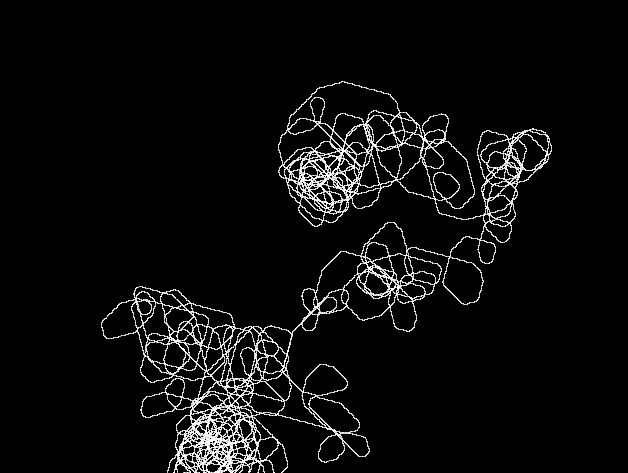

## Life has a way of surprising you

Recently I had my future all laid out in front of me. It was everything I wanted, and there was nothing that could mess it up. 
Then one day, that path wasn't possible anymore. 

  

In life, just when you think you know what your life has in store, you realize that you don't know anything for sure. But you just have to keep going, because life goes on. And when you look back and see all the things everything that you have been through, you will realize it all happened for a reason. 

  

This poem is a testament to that. 

  

